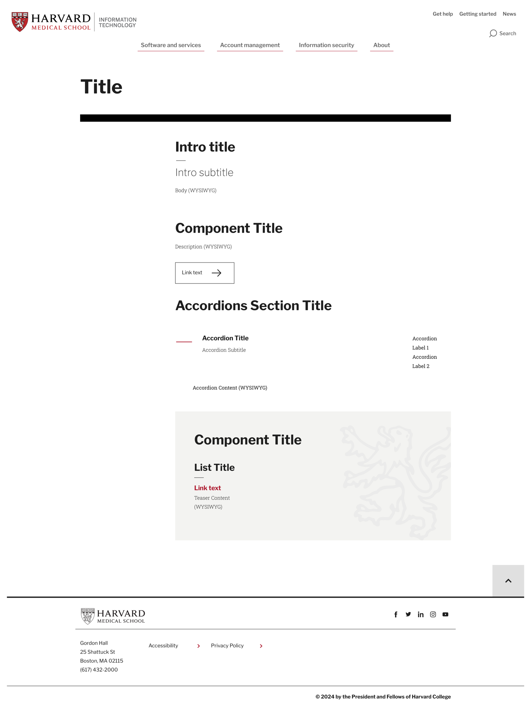
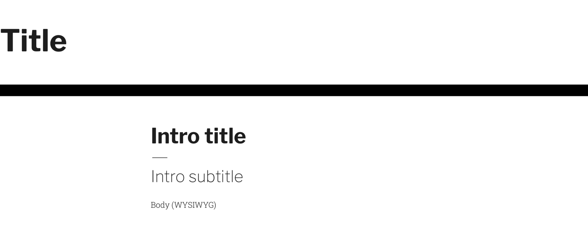
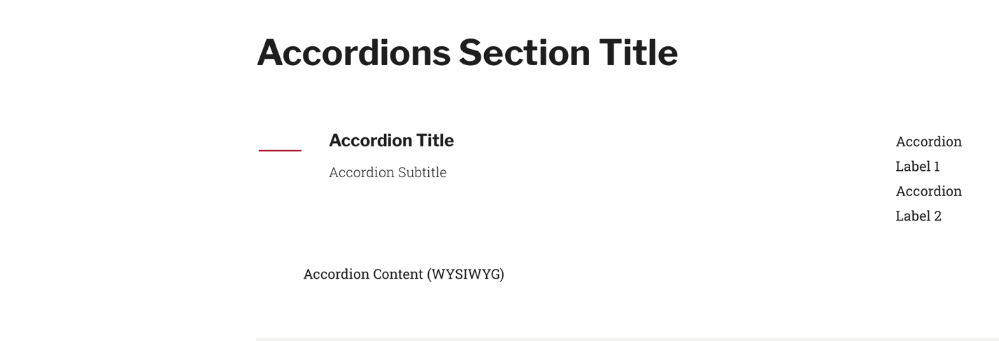
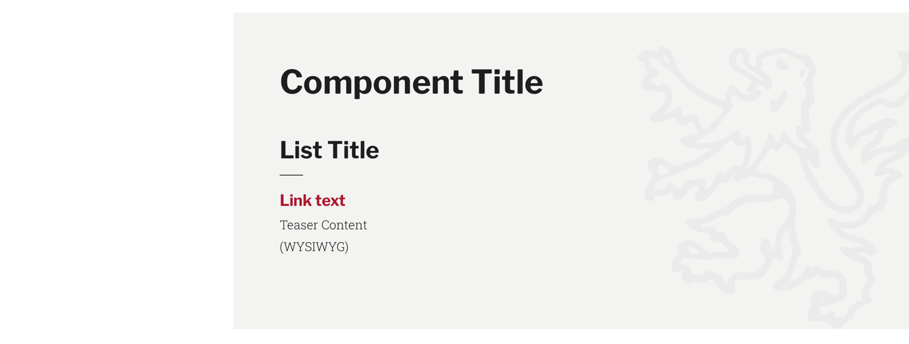

# Content guidelines for HMS IT web pages—DRAFT

*Editorial and structural guidance for HMS IT website content*

## Introduction

The purpose of this document is to provide detailed content guidelines for the HMS IT website, ensuring **consistency in structure, tone, and functionality across all web pages**. These guidelines are designed to help content creators and managers craft user-focused pages that communicate information effectively while aligning with HMS IT’s broader goals of accessibility, clarity, and user satisfaction.

This document **applies to all web pages hosted on the HMS IT website that don’t have more specific guidance** (like for services or news articles). It is intended for use by content creators, editors, and managers responsible for creating, reviewing, or maintaining web content. The guidelines cover editorial practices, suggestions and standards within the content management system (CMS), and user experience considerations such as tone, voice, and action-oriented design elements.

Consistency in web content is critical for user trust and effective communication. Misalignment in content structure or tone can lead to confusion, increased support requests, and decreased user satisfaction. To address these challenges, **this document incorporates best practices from content strategy, usability studies, and input from HMS IT stakeholders**. By standardizing web content creation and maintenance processes, we aim to meet user needs and reduce the reliance on direct IT support.

### Related governance

TBD

## Summary

Organize content using clear, concise, consistent language and formatting to reduce support queries from HMS faculty, students, staff, and affiliates.

Format pages into these major sections:

- **Titles and introductions** – Use descriptive titles and concise intros to orient users and help them quickly understand the page's purpose.
- **Call-to-action (CTA)** – Write action-oriented titles, brief descriptions, and specific link text to guide users toward completing key tasks.
- **Accordions** – Group content with clear titles, concise summaries, and readable sections to improve navigation and make information easy to scan.
- **Resources** – Use meaningful titles, clear link text, and brief explanations to direct users to additional information or tools.

## Guidelines

This section provides **content structure and editorial guidance** for HMS IT standard web pages. The goal is to maintain consistency, enhance readability, and ensure that content aligns with user needs and expectations.

### Purpose and goals

- **Objective** – Deliver clear, accessible information about HMS IT topics and services in a structured, user-friendly format.
- **User needs** – Quickly finding IT information, instructions, and resources to guide them toward their goal.
- **Business goals** – Reduce support queries, promote self-service, and enhance user satisfaction while supporting HMS’s mission.

### Audience

- **Primary** – HMS faculty, students, staff, and affiliates seeking IT services, policies, or instructions.
- **Secondary** – IT staff directing users to the website for support.

### Tone and voice

Use an **informative and supportive tone**, prioritizing simplicity and avoiding technical jargon. Content should be concise, action-oriented, and segmented into user-friendly sections.

## Key fields

This section provides field-specific guidance to ensure consistency and usability across pages. 

### Titles and introduction

Titles and introductions orient users, helping them quickly understand the page’s content and purpose. 

#### Title

- **CMS field** – **Main content** > **Title**
- **HTML5 tag** – `<h1>`
- **Purpose** – Clearly communicate the page's topic, aligning with user search intent.
- **Guidance** – Use descriptive, straightforward phrasing that matches common search terms.
- **Examples**:
    - *Reset your password or unlock your HMS account*
    - *Information security*

#### Intro title

- **CMS field** – **Introduction** > **Intro Title**
- **HTML5 tag** – `<h2>`
- **Purpose –** Summarize the page’s content or key benefit.
- **Guidance** – Keep it short (five to eight words) and user-focused.
- **Examples**:
    - *Manage your HMS account with these tools*
    - *Protecting the integrity of the HMS mission*

#### Intro Subtitle (optional)

- **CMS field** – **Introduction** > **Intro Subtitle**
- **HTML5 tag** – `<h3>`
- **Purpose** – Provide a concise description of the page's objective.
- **Guidance** – Write one impactful sentence emphasizing user benefits.
- **Examples**:
    - *Learn how to access HMS networks and accounts.*
    - *Follow these steps to secure your devices and data.*

#### Body

- **CMS field** – **Introduction** > **Body (WYSIWYG)**
- **HTML5 tag** – `
`
- **Purpose** – Offer a brief, introductory overview of the page content.
- **Guidance** – Limit to two to four sentences. Use `<h4>` subheadings to organize content if necessary.
- **Example**:
    - *This guide provides essential steps for accessing HMS IT services and managing your account securely. Follow each section to set up your devices and protect your data.*

### Call-to-action Component

Call-to-action (CTA) components address users’ primary goals by guiding them to complete specific tasks. 

#### Component Title

- **CMS field** – **Components** > **Component Title**
- **HTML5 tag** – `<h2>`
- **Purpose** – Name the section to guide users to key actions or CTAs.
- **Guidance** – Use short, action-oriented titles.
- **Examples**:
    - *Network connection options*
    - *Setting up two-factor authentication*

#### Component Description

- **CMS field** – **Components** > **Description (WYSIWYG)**
- **HTML5 tag** – `
`
- **Purpose** – Briefly explain the section’s purpose or required action.
- **Guidance** – Write 1–2 concise sentences.
- **Examples**:
    - *Follow these steps to connect to the secure HMS wireless network.*
    - *Learn how to activate two-factor authentication for added security.*

#### Component Link

- **CMS field** – **Components** > **Link text**
- **HTML5 tag** – `<a>`
- **Purpose** – Direct users to the desired action.
- **Guidance** – Use descriptive, action-oriented text. Avoid generic phrases like *Click here*.
- **Examples**:
    - *Activate your account*
    - *Explore connection options*

### Accordion

Accordions present key information in expandable sections, making it easier for users to scan and explore content. 

#### Accordion Section Title

- **CMS field** – **Accordions** > **Accordion Section Title**
- **HTML5 tag** – `<h2>`
- **Purpose** – Group content into expandable sections for navigation.
- **Guidance** – Title should summarize the content grouping. Leave blank if there are no grouped sections.
- **Examples**:
    - *Account management*
    - *Network and connectivity options*

#### Accordion Title

- **CMS field** – **Accordions** > **Accordion Title**
- **HTML5 tag** – `<h3>`
- **Purpose** – Identify the topic covered in each accordion.
- **Guidance** – Use short, action-oriented titles.
- **Examples**:
    - *Set up your account*
    - *Connect to Wi-Fi on campus*

#### Accordion Subtitle

- **CMS field** – **Accordions** > **Accordion Subtitle**
- **Purpose –** Summarize the accordion content.
- **Guidance** – Write one concise sentence highlighting the key action or point.
- **Examples**:
    - *Step-by-step instructions for account setup*
    - *Choose the best connection option for your needs*

#### Accordion Labels

- **CMS field** – **Accordions** > **Accordion Label 1, Accordion Label 2**
- **Purpose** – Indicate subtopics or actions covered in the accordion for quick scanning.
- **Guidance** – Use concise terms (one to two words). If the labels don’t add clarity, leave them blank.
- **Examples**:
    - Label 1: *Setup*, Label 2: *Troubleshooting*
    - Label 1: *Options*, Label 2: *Requirements*

#### Accordion Content

- **CMS field** – **Accordions** > **Accordion Content (WYSIWYG)**
- **HTML5 tag** – `
`
- **Purpose** – Provide detailed instructions or information.
- **Guidance** – Use short paragraphs or bullet points to enhance readability. Start subheadings with `<h4>` if needed.
- **Examples**:
    - *To activate your account, start by…*
    - *Choose from the following network options to connect…*

### Resources

Resource components link users to external or related content for further exploration.

#### Component Title

- **CMS field** – **Resources** > **Component Title**
- **HTML5 tag** – `<h2>`
- **Purpose –** Group related links under a clear heading.
- **Guidance** – Describe the type or purpose of the resources.
- **Examples**:
    - *Additional support*
    - *Useful links for IT services*

#### List Title

- **CMS field** – **Resources** > **List Title**
- **HTML5 tag** – `<h3>`
- **Purpose –** Title for grouped links (if multiple lists are present).
- **Guidance** – Use only if multiple resource lists exist.
- **Examples**:
    - *Troubleshooting guides*
    - *Network resources*

#### Link Text

- **CMS field** – **Resources** > **Link text**
- **HTML5 tag** – `<a>`
- **Purpose** – Describe the destination or purpose of the link.
- **Guidance** – Use descriptive, action-oriented text.
- **Examples**:
    - *Contact IT support*
    - *Download VPN client*

#### Teaser Content

- **CMS field** – **Resources** > **Teaser Content (WYSIWYG)**
- **HTML5 tag** – `
`
- **Purpose** – Briefly explain the resource or link.
- **Guidance** – Write one to two sentences. Avoid using subheadings.
- **Examples**:
    - *Get help with account setup and troubleshooting.*
    - *Download the required software for secure remote access.*
