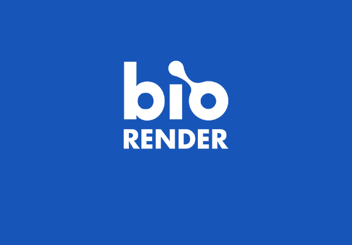
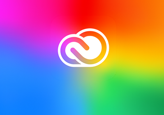
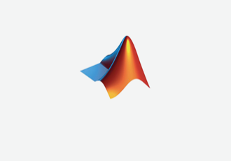
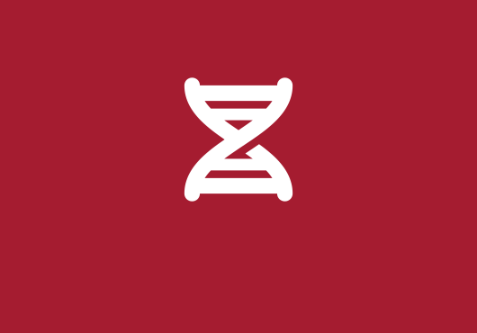

# Content template for services on the HMS IT website

## *Guidelines for structuring service pages on the HMS IT website to ensure clear, consistent, and user-friendly communication*

## Introduction

The purpose of this document is to provide a structured framework for creating and managing service-related content on the HMS IT website. Following these guidelines ensures that all service descriptions are presented clearly, consistently, and in a user-friendly format. The document serves as a resource for those responsible for adding or updating service information, offering a template that helps improve user experience and meet content governance standards.

This document applies to all IT services offered through HMS IT and covers creating **service-related content** within the website's content management system (CMS). It includes specific guidelines for content entry fields, the structure of information, and the use of CMS components such as accordions, images, and access links. The guidelines are mandatory for new service pages and must be followed when updating existing service content.

This content template was developed in response to the need for a standardized approach to documenting IT services on the HMS IT website. Variations in navigation and structure previously made services more difficult for users to find and learn about. By standardizing service descriptions, access links, eligibility criteria, and related details, we aim to enhance the usability and accessibility of IT service information for the HMS community. The template is informed by web analytics and a comprehensive card sort exercise. It was created in consultation with the HMS IT Web Working Group and the HMS IT Communications Steering Group.

### Related governance

- [Communications governance for the HMS IT website](https://hu.sharepoint.com/:f:/r/sites/HMSITAllStaff-Internal/IT%20Internal%20documents/Communications%20governance/HMS%20IT%20website?csf=1&web=1&e=JEM71T) (folder)

## Summary

Ensure consistent service pages to make services and the information about them easy for users to locate. Help users quickly determine eligibility and access the services. Provide self-service guidance to reduce support tickets. 

- **Service name** – Match common search queries for easy identification.
- **Short description** – Offer a summary of what the service provides.
- **Introductory paragraph** – Highlight core functionalities and benefits, engaging users with a concise overview.
- **Access link** – Make the access link bold and prominent.
- **Details** – Use accordions for comprehensive information on eligibility, security, and other key details.
- **Eligibility** – Define who can use the service and summarize key criteria.
- **Security** – Outline security requirements, including two-factor authentication and secure connection guidelines.
- **Additional sections** – Follow the format of eligibility and security for other key details.
- **Learn more** – Provide links to additional resources, grouped under descriptive titles as needed.
- **Categorization and teasers** – Select appropriate CMS categories and add consistent branding elements with images or icons.

## Content brief

This section defines the guidelines for services on the HMS IT website, ensuring consistent presentation across all service pages.

### Purpose and goals

- **Page objective** – Establish a comprehensive overview of services offered and supported by HMS IT. Ensure each service is presented clearly and consistently, enhancing the user experience.
- **User needs** – Users need clear, accessible, and well-structured information about IT services, including how to access services, who is eligible, and the security measures in place. The content should reduce confusion and guide users in selecting and accessing the appropriate service.
- **Business goals:**
    - **Reduce support tickets** by providing clear instructions and eligibility criteria.
    - Improving **findability** of service offerings.

### Audience

#### Target audience

- **Primary** – HMS faculty, staff, students, and guests who require access to IT services.
- **Secondary** – HMS IT staff looking for information on available services when assisting users.

#### Potential user pain points

- Difficulty finding relevant IT service information due to unclear categorization or unhelpful titles and short descriptions.
- Inconsistent presentation of service details on the service page makes it harder for users to quickly find the information they need.
- Unclear eligibility criteria and access instructions potentially mislead users and cause frustration and disappointment.

### Tone and voice

The voice should be **informative and supportive**, providing clear, action-oriented guidance. The tone must balance **technical accuracy** with **user-friendly language**, avoiding jargon.

### Calls to action (CTAs)

- **Primary CTA** – Direct users to access and use the service.
    - Example: *Connect to the HMS VPN*
- **Secondary CTA** – Guide users in signing up for the service if it is not already available to them.
    - Example: *Register to access the AI Sandbox*

## Content template

### Summary information

#### Service name

- **CMS field** – <kbd>Title</kbd>
- **Purpose** – Communicate the **name of the service**.
- **Guidance** – Use the service's official name if there is one; otherwise, aim to keep it precise and recognizable to users.
- **Example** – *VPN*

#### Short description

- **CMS field** – <kbd>Subtitle</kbd>
- **Purpose** – Provide a concise, straightforward description of what the user can do with the service.
- **Guidance** – Limit this to one sentence. Be direct and specific.
- **Example** – *Securely connect to HMS resources from anywhere*

#### Introductory paragraph

- **CMS field** – <kbd>Body</kbd>
- **Purpose** – Offer a more detailed explanation of the service's key features and benefits.
- **Guidance** – Keep this section short (2-3 sentences), emphasizing user benefits and key functionality.
- **Example** – *HMS VPN service facilitates a secure virtual connection, allowing the HMS community to safely access campus resources from remote locations. Simply download the Ivanti Secure Access Client software and follow the step-by-step guide to establish a secure connection.*

##### Access link

- **CMS field** – <kbd>Body</kbd>
- **Purpose** – Provide a **prominent, bolded link** to the service or tool.
- **Guidance** – Ensure the link is easy to find, clearly labeled, and concise.
- **Example** – **Access the HMS VPN service**

### Details

```html
Details must be presented in accordions and created in the **Component** tab under **Add Accordions**. The <kbd>Accordions Section Title</kbd> field must be left blank.
```
#### Eligibility

- **CMS field** – <kbd>Accordion Title</kbd>
- **Purpose** – Label the *Eligibility* section.
- **Guidance** – Always use *Eligibility*.
- **Example** – *Eligibility*

##### Eligibility short description

- **CMS field** – <kbd>Accordion Subtitle</kbd>
- **Purpose** – Provide a summary of eligibility criteria.
- **Guidance** – Use one short sentence or phrase. Be concise and direct. Focus on summarizing key criteria.
- **Example** – A*vailable only to HMS Quad-based faculty and staff*

##### Eligibility label

- **CMS fields** – <kbd>Accordion Label 1</kbd> and <kbd>Accordion Label 2</kbd>
- **Purpose** – Indicate the main topics covered when the accordion is expanded.
- **Guidance** – Use short, one- or two-word labels that succinctly describe the content.
- **Example** – *Faculty*, *Staff*

##### Eligibility description

- **CMS field** – <kbd>Accordion Content</kbd>
- **Purpose** – Provide detailed information about eligibility for the service.
- **Guidance** – Clearly outline who is eligible for the service.
- **Example** – *If you are a member of the HMS Quad-based faculty or staff, you are automatically registered to use this service.*

#### Security

Follow the same structure as **Eligibility** but focus on the security recommendations or requirements for the service. For example:

- <kbd>Accordion subtitle</kbd> – *Options for a secure connection and authentication*
- <kbd>Accordion labels</kbd> – *Connection, 2FA*
- Accordion content – To guarantee a secure connection, the HMS VPN requires users to set up the [Duo mobile app](https://harvardmed.service-now.com/stat?id=kb_article&sysparm_article=KB0010829) for two-factor authentication, enhancing the safety of their data. Disconnect from other VPN services before connecting to the HMS VPN to avoid conflicts and maintain security.

#### Additional sections

Follow the same guidelines as the eligibility and security sections.

### Learn more

This section provides guidelines for adding links to additional resources using the **Resources** component. These links help users access supplementary materials, guides, or related services.

#### List title

- **CMS field** – <kbd>List Title</kbd>
- **Purpose** – Label the links section.
- **Example** – Always *Learn more*

#### Resources lists

```html
If there are many resources, group them and set the group name under **Resources component** > **Resource Lists** > **List Title**. If there are not enough links to be grouped, or no clear grouping can be made, leave <kbd>List Title</kbd> blank.
```
- **CMS field** – <kbd>List Title</kbd>
- **Message purpose –** Group related resources together for easier navigation, particularly when there are multiple links. This improves content organization and user comprehension.
- **Guidance** – If there are multiple resources, group them under a **List Title** with a clear, descriptive label. Avoid using teaser images for the links.
- **Example** – *Setup and connection guides*

##### Resource list items

- **CMS field** – <kbd>URL</kbd>
- **Purpose** – Provide the **direct link** to the resource. The URL should direct users to additional materials, help guides, or external services.
- **Guidance** – Ensure all URLs are functional, up-to-date, and point to credible resources.
- **CMS field** – <kbd>Link text</kbd>
- **Purpose** – Describe the link destination.
- **Example** – VPN portal guidelines
- **CMS field** – <kbd>Teaser content</kbd>
- **Purpose** – Elaborate on what is provided by the link.
- **Guidance** – Keep the link text straightforward and action-oriented. It should communicate the purpose of the resource.
- **Example** – *Learn how to connect to the HMS VPN.*

### Categorization

Select the appropriate category in the CMS's **Advanced** tab based on card sort results or alignment with other items.

### Teaser

#### Teaser image

- **CMS field** – <kbd>Teaser Image</kbd>
- **Purpose** – Make it easy for users to find a service using a recognizable logo or relevant icon.
- **Guidance** – Center the logo or icon with equal margins on all sides. Move the logo upwards to leave space for the text overlay that will appear above it in the services list. Ensure the size and positioning of the logo are consistent with the other service images. The teaser image must be one of the three:
- **For services with their own branding**, prefer versions of the logo without text. Use these configurations in this priority order:
    1. The single-color version of the logo set in white (hex code `#ffffff`) against the service's primary brand color.



    1. The single-color version of the logo set against the service's primary brand background, as they represent it on social media or elsewhere.



    1. The single-color version of the logo set against off-white background (`#f3f4f4`), as they represent it on social media or elsewhere.


    1. The multi-color version of the logo set against the service's primary brand color, as they represent it on social media or elsewhere.


    1. The multi-color version of the logo set against off-white background (`#f3f4f4`), as they represent it on social media or elsewhere.



- **For services without an identifiable logo**:
    1. Select an icon from the free Font Awesome collection and set it in white (`#ffffff`) against a color otherwise associated with the service.
    1. If no color is associated with the service, select an icon from the free Font Awesome collection and set it in near black (`#1e1e1e`) against an off-white background (`#f3f4f4`).
- **For services provided by HMS IT** – Select an icon from the free Font Awesome collection and set it in white (`#ffffff`) against a Crimson (`#a51c30`) background.



##### Alt text

- **CMS field** – <kbd>Alternative text</kbd>
- **Message purpose** – Provide a short description to help screen readers and users with visual impairments understand what the image represents.
- **Guidance** – Alt text must clearly describe the brand or icon displayed and any text contained within the logo. For icons, describe the icon.
- **Example** – *Zoom logo*, *Phone icon*

#### Card short description

```html
Leave the <kbd>Teaser Text</kbd> field blank unless the service item points to an outside resource. In that case, follow the guidelines for the **Service short description** field mentioned earlier.
```
#### Link

```html
Only enter a URL in the <kbd>Teaser External Link</kbd> field if the card points to an external resource and does not have its own page.
```
