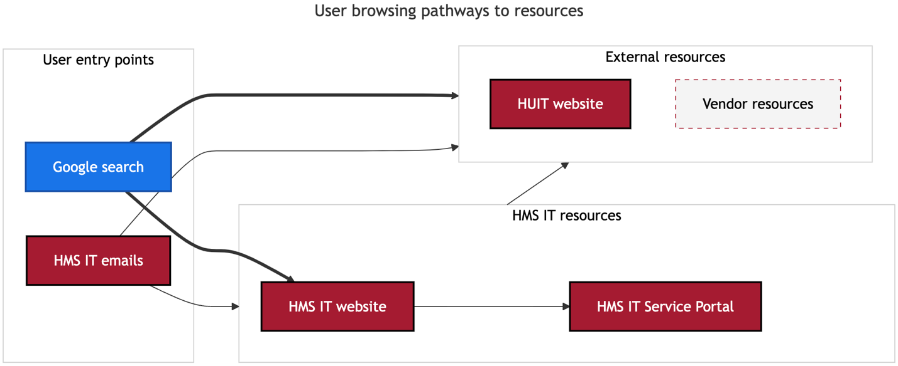

# Navigation and organization of content on the HMS IT website

*Information architecture based on user research and card sort surveys*

## Introduction

This document provides a guide to the information architecture of the HMS IT website. It is intended for content creators, website managers, and IT staff responsible for organizing and maintaining the site's structure. The goal is to **align the website's navigation and content organization with user expectations**, improving usability and ensuring that key resources and services are easy to find.

The guidelines outlined in this document apply to the entire HMS IT website. They govern the top-level navigation, secondary navigation, and categorization of all content hosted on the site. This includes software, services, account management tools, policy-related content, and access to security resources. **These guidelines must be used by all** involved in content updates, design changes, and user experience improvements.

The current website structure is the result of extensive user research, including a card sort survey conducted with HMS community members. Participants grouped content items and named categories based on their mental models, revealing where they expect to find specific services and resources. This user-driven approach was further refined using analytics data to understand high-traffic areas and frequently accessed content. **The navigation is designed to reflect users’ primary needs and expectations.** A flexible secondary navigation allows content to appear in multiple relevant areas, ensuring that users can access important services from various points on the site.

### Related governance

- [Communications governance for the HMS IT website](https://hu.sharepoint.com/:f:/r/sites/HMSITAllStaff-Internal/IT%20Internal%20documents/Communications%20governance/HMS%20IT%20website?csf=1&web=1&e=DS0qvY) (folder)

## Summary

The HMS IT website serves as a gateway within the HMS and Harvard University ecosystem, guiding users to key resources like service offerings, security practices, and the HMS IT Service Portal. Supported in part by HUIT resources, it aligns content with user searches and directs them to more specific information on the Portal or elsewhere. HMS IT also directs users to the website through emails, providing updates and linking to website pages and news articles for more details.

The information architecture of the HMS IT website is built around user preferences, gathered through a card sort to align with how users expect to find content. The main navigation is structured into four primary categories based on these insights:

1. **Software and services** – This is the most frequently accessed section, reflecting users' primary need for software and services. Flexible secondary navigation enables services to appear under multiple relevant categories, including account management, communication tools, research computing, and information security.
1. **Accounts and access** – This section provides direct access to tools for account management, including password resets and guest account services, addressing core user needs.
1. **Information security** – A key grouping for users and a critical focus for the organization, this section highlights security requirements, software, and best practices.
1. **About** – This section covers HMS IT's mission, leadership, internal departmental structure, and official policies and guidelines. Centralizing this information here allows the rest of the site to follow a navigation model that better aligns with user expectations and understanding, presenting policies and guidelines in a more concise, contextually relevant, and user-friendly way, while linking to the full text of policy documents.

The utility navigation directs users to the HMS IT Service Portal for **Getting help**, a **Getting started** guide for new users, and the **News** section for updates and announcements.

## Information architecture for the HMS IT website

The HMS IT website navigation is based on user preferences identified through a card sort conducted within the HMS community. In the card sort, participants grouped items and named the categories, revealing their mental models and where they  to find content. The website's navigation is aligned with these expectations to improve access to services, resources, and support. Analytics data also informs the design.

The primary navigation reflects user-created clusters, with categories like accounts, information security, and research tools. It focuses on frequent user needs, simplifying access to high-demand services such as software, communication tools, and account management. CMS capabilities, including a filterable catalog, further enhance usability by supporting flexible secondary information architecture for software and services.

All content must fit within this structure.

### HMS IT website in context

The HMS IT website sits within the context of the main HMS website and brand and  sub-sites run by different departments. On a larger scale, the site operates within the broader Harvard University ecosystem. **Harvard University Information Technology (HUIT) plays an essential support role**, with their site offering University-wide services that complement those specific to HMS.

The HMS IT website serves as a polished entry point, efficiently directing users to essential resources such as service offerings, security best practices, account details, onboarding, and documentation and transactions on the HMS IT Service Portal. **Users typically arrive at the website from search**, and the site "pulls" them in by aligning its content with the information they are seeking. From there, the website directs users to more specific information, such as vendor documentation or the HMS IT Service Portal.

In addition to the website, HMS IT engages the community through broadcast emails that highlight new services, changes, or notify users about service disruptions. These **emails often direct users to specific pages on the website** for more comprehensive overviews. HMS IT also publishes related news articles, offering deeper context to complement concise email communications.

#### User flow diagram for IT services

### Main navigation

The top-level navigation includes four primary categories, which serve as anchor points for users:

- Software and services
- Accounts and access
- Information security
- About

#### Software and services

This category is prominently placed in the navigation to ensure easy discoverability, reflecting that the top user need is to learn about and access HMS IT's offerings.

To maintain an organized and user-friendly catalog, every service listed must be fully supported by HMS IT. Services must represent offerings that users expect to find, are continuously available, and are backed by a responsible team for delivery, support, and troubleshooting. Listing a service indicates that HMS IT is accountable for providing support, so limiting the catalog to supported services prevents confusion about support pathways and fosters user trust that the catalog is a reliable resource for services directly managed by HMS IT.

Including unsupported services introduces risks such as security vulnerabilities, compliance violations, and inefficiencies in troubleshooting. It can frustrate users when HMS IT is unable to provide the expected support, leading to misaligned expectations and inefficient use of HMS IT resources. Focusing the catalog solely on supported services improves the user experience and aligns with institutional policies and strategic priorities.

Exceptions are made only when analytics reveal frequent user searches on the HMS IT website for a service supported by HMS or Harvard. In these cases, the service may be listed with a link to a resource page outside the HMS IT website, clearly indicating the boundaries of HMS IT’s responsibilities. This approach balances ease of access to important tools with the need for clear communication about support limitations.

The section is further broken down into specific categories based on user mental models identified during the card sort. Organizing content according to these logical categories helps users find services efficiently. A service can be placed in multiple relevant categories. Categories and services may also be included in the sidebar navigation in other related areas of the site. For example, services related to account management might be linked when browsing the general *Accounts and access* page, or information security apps might be linked from the general *Information security* page. This approach allows users to discover services organically.

The categories represent key areas where users frequently seek assistance:

- **Account management** – Encompassing account-related services, such as password resets and account unlocks.
- **Administrative systems** – Resources for administrative processes and tools.
- **Communication and productivity** – Includes tools for collaboration, creative work, and day-to-day communication:
    - **Creative tools**
    - **Email and calendars**
    - **File storage**
- **Computers and hardware** – Services related to hardware procurement and support.
- **Information security** – Emphasizing security tools and services available to users.
- **On-campus services** – Support services and resources available specifically for on-campus needs.
- **Research and data science** – Tools and software supporting academic and scientific research:
    - **Data science software**
    - **Library tech services**
    - **Reference management**
- **Research computing** – High-performance computing resources tailored for research needs.
- **Teaching and learning** – Services that support educational activities, such as course management tools.
- **Web publishing and hosting** – Hosting and support services for HMS-related web content.
- **Wired and wireless networking** – Resources related to the network infrastructure available to users.

#### Account management

This section simplifies access to account-related actions, such as resetting or unlocking HarvardKey and HMS accounts, addressing a common need highlighted in the card sort.

- **HMS account**
- **Reset your password or unlock your HMS account**
- **HMS account for guests**
- **HMS email account**
- **HarvardKey**
- **Harvard University ID (HUID)**

#### Information security

This includes security requirements, best practices, and recommendations. The placement of this section stems from strong groupings in the card sort that highlighted user interest in security-related content.

- **Security requirements**
- **Security software**
- **Network access security**
- **Security assessments**
- **VPN**
- **Two-factor authentication (2FA)**
- **Security liaisons**

#### About

This contains information about HMS IT's mission, leadership, departments, and official policies and guidelines. 

- **Leadership**
- **Departments**
- **Policies and guidelines**
- **Projects**
    - Features major initiatives that require additional communications beyond emails, news articles, or KBs. It serves as a centralized resource for HMS-wide projects that are particularly complex or have significant community impact. Very few projects — if any — will be listed here. This page is reserved for those rare initiatives requiring extensive communication efforts that exceed the scope of standard formats like news articles. Unlike most other evergreen pages on the website, this page is intended to be archived after the information is no longer relevant or needed by the community.

### Utility navigation

In addition to the top-level navigation, a utility navigation bar points to critical resources:

- **Get help** – This links to the HMS IT Service Portal, which provides access to the knowledge base and ticket requests, emphasizing the portal's role in troubleshooting and self-help.
- **Getting started** – A general onboarding checklist for new students, staff, and faculty, ensuring easy access to essential information for new members of the HMS community.
- **News** – Timely updates about planned outages, new feature launches, and other announcements, keeping users informed of important changes.
