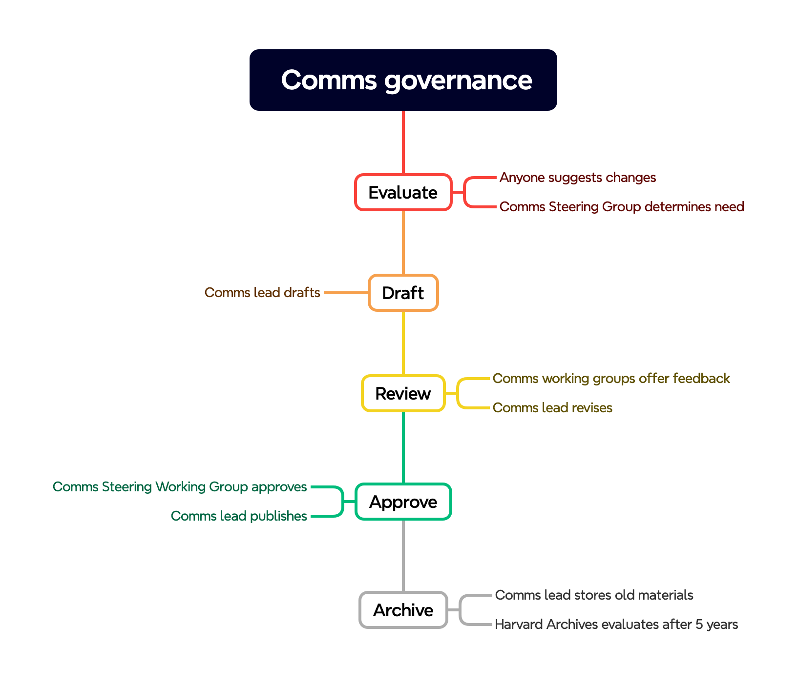

# Workflow for communications governance documents on SharePoint

*Process for creating and revising finalized communications governance documents for SharePoint*

## Introduction

This document outlines the process for creating, editing, and archiving content governance for HMS IT communications. It aims to clarify workflows, roles, and responsibilities to ensure governance is practical, high-quality, and approved by communications governance working groups. This document applies to any content governance shared on SharePoint for HMS IT staff.

## Related governance

- [Organization of communications governance documents at HMS IT](file:///Users/joseph-casciano/Library/CloudStorage/OneDrive-HarvardUniversity/IT%20Internal%20documents/Communications%20governance/Internal%20communications/Communications%20governance%20documents/Organization%20of%20communications%20governance%20documents%20at%20HMS%20IT.docx)
- [Template for finalized communications governance documents on SharePoint](file:///Users/joseph-casciano/Library/CloudStorage/OneDrive-HarvardUniversity/IT%20Internal%20documents/Communications%20governance/Internal%20communications/Communications%20governance%20documents/Template%20for%20finalized%20communications%20governance%20documents%20on%20SharePoint.docx)

## Summary

1. **Evaluate**
    1. Anyone suggests changes
    1. Comms Steering Group determines need
1. **Draft**
    1. Comms lead drafts
1. **Review**
    1. Comms working groups offer feedback
    1. Comms lead revises
1. **Approve**
    1. Comms Steering Working Group approves
    1. Comms lead publishes
1. **Archive**
    1. Comms lead stores old materials
    1. Harvard Archives evaluates after 5 years

 

## Workflow

### New content

1. **Identifying content need**
    1. *Anyone at HMS IT* can recommend new content governance.
    1. The *Communications Steering Working Group* discusses and determines if new content governance is required.
1. **Creation** – The *communications lead* drafts the content governance according to existing templates, considering stakeholder discussions, working group input, and best practices in content strategy.
1. **Review and revision**
    1. *Relevant working group members* review the content and offer feedback.
    1. The *communications lead* revises the draft based on the feedback.
1. **Approval** – The *Communications Steering Working Group* provides final approval for content governance.
1. **Publishing** – The *communications lead* finalizes and posts the approved document to SharePoint.

The *communications lead*, representing the communications steering working group, owns the content.

### Minor revisions

The *communications lead* can make minor revisions at any time.

### Major revisions

1. **Identifying revision needs**
    1. *Anyone at HMS IT* can recommend revisions to content governance.
    1. *Relevant working group members* discuss and determine if significant revisions are necessary.
1. **Revision** – The *communications lead* drafts the revisions.
1. **Review**
    1. *Relevant working group members* review the content and offer feedback.
    1. The *communications lead* finalizes revisions based on feedback.
1. **Approval** – The *Communications Steering Working Group* provides final approval for content governance.
1. **Publishing** – The *communications lead* publishes major revisions that have been approved.

### Archiving content

1. Initial storage – The communications lead follows [Procedure Records (1127)](https://grs.harvard.edu/procedure-records-1127) and places deprecated and superseded procedures in the archive folder in the communications working group folder on SharePoint.
1. **Evaluation**
    1. The communications lead [contact archives](https://library.harvard.edu/how-to/transfer-your-historically-significant-records-university-archives) to request a review five years after the content was archived.
    1. *Harvard University Archives* determines if the content needs to be transferred to the University Archives.
1. **Transfer and cleanup** – The *communications lead* follows the recommendation from the archive to transfer and delete content.

## Roles and responsibilities

### Communications lead

- Drafts and revises content governance according to existing templates and stakeholder discussions.
- Shares drafts and major revisions with the working groups for additional feedback and revisions.
- Revises drafts based on feedback from relevant working group members.
- Finalizes and posts approved content governance to SharePoint.
- Places deprecated and superseded procedures in SharePoint's archives folder in the Communications Steering Working Group folder.
- Contacts archives to review records after the retention period.

If the communications lead is unable to perform these responsibilities, they fall to the first person on this list who is available:

1. Associate Director, IT Support Services
1. Director of Client Services
1. Associate CIO IT Strategic Service Design and Delivery
1. Assistant Director, Business Engagement and Administration

### Communications Steering Working Group

- Discusses and determines if new content governance and major revisions are required.
- Provides feedback and approves content governance.

### Other communications working groups (KB, website, email)

- Review drafted content governance for their area and provide input.
- Approve major revisions to existing content governance for their area.

### Harvard University Archives

- Reviews archived content after five years.
