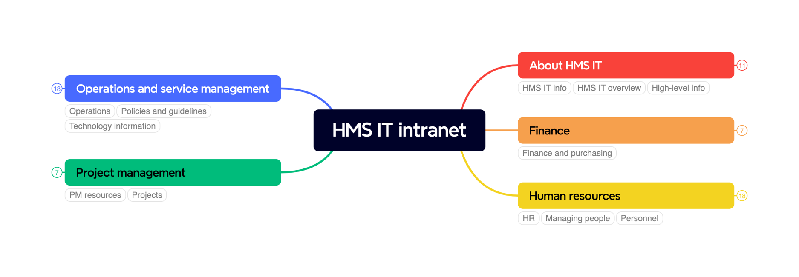

# Navigation and organization for the HMS IT intranet

*Information architecture for the HMS intranet for staff hosted on SharePoint, ensuring a consistent and user-friendly experience for key organizational areas.*

## Introduction

This document defines and standardizes the information architecture for the HMS IT intranet on SharePoint. It provides guidance on organizing, labeling, and categorizing content to ensure employees can easily find and interact with essential information. The primary audience includes content managers, intranet administrators, and anyone responsible for maintaining the SharePoint site.

This document applies to all content on the HMS IT intranet, covering domains such as IT governance, finance, human resources, project management, and operations. All teams and individuals responsible for content creation and management must follow these guidelines to ensure consistency in information structure and access.

The HMS IT intranet is a central hub for employees to access vital information, tools, and resources. Over time, inconsistent labeling, content placement, and lack of standardized structure can make navigation challenging. To address this, a working group reviewed existing content and conducted a card sort exercise with HMS IT staff to understand their organizational preferences. The resulting information architecture guide aligns with staff expectations and aims to enhance user experience and internal communication.

### Related governance

- [Content brief for HMS IT intranet pages](https://hu.sharepoint.com/:w:/r/sites/HMSITAllStaff-Internal/IT%20Internal%20documents/Communications%20governance/Internal%20communications/HMS%20IT%20intranet%20on%20SharePoint/Content%20brief%20for%20HMS%20IT%20intranet%20pages.docx?d=wc2611d6215774545b0057934e32266bc&csf=1&web=1&e=OaZWk0)
- [Wireframes for category pages of the HMS IT intranet (PDF)](https://hu.sharepoint.com/:b:/r/sites/HMSITAllStaff-Internal/IT%20Internal%20documents/Communications%20governance/Internal%20communications/HMS%20IT%20intranet%20on%20SharePoint/Wireframes%20for%20category%20pages%20of%20the%20HMS%20IT%20intranet.pdf?csf=1&web=1&e=4PPkaa)
- [Wireframes for the home page of the HMS IT intranet (PDF)](https://hu.sharepoint.com/:b:/r/sites/HMSITAllStaff-Internal/IT%20Internal%20documents/Communications%20governance/Internal%20communications/HMS%20IT%20intranet%20on%20SharePoint/Wireframes%20for%20the%20home%20page%20of%20the%20HMS%20IT%20intranet.pdf?csf=1&web=1&e=FQxMct)

## Summary

This information architecture guideline outlines the structure of the HMS IT intranet, organizing content into key sections relevant to various operational areas. Each section is labeled with specific keywords that staff commonly associate with the content.

1. **About HMS IT** – Provides high-level information about the organization, including strategy, governance, team structures, and emergency contacts.
1. **Finance** – Covers procurement and purchasing procedures, asset lifecycle management, and financial tools, focusing on the management of company resources.
1. **Human resources** – Focuses on professional development, onboarding and offboarding processes, and general guidance for staff, including hiring, training, and dispute resolution.
1. **Project management** – Includes resources and guidelines for managing projects, focusing on strategic projects, tools, and methodologies.
1. **Operations and service management** – Encompasses service management guidelines, communication tools, and facilities management, addressing IT operations, incident handling, and team collaboration tools.

## 

## Information architecture for the HMS IT intranet

### About HMS IT

Staff also labeled content like this *HMS IT overview*, *HMS IT info*, *High-level info*

#### Strategy and statements

- Strategy overview
- Company diversity statement
- Company rules and agreements

#### Structure

- Company governance information
- List of teams and services
- Organization chart
- Communication groups structure
- Company calendar
- Emergency contact list

### Finance

Staff also labeled content like this *Finance and purchasing*

#### Procurement

Staff also labeled content like this *Asset lifecycle management*

- Hardware ordering procedures
- Purchasing procedures
- Finance tools and guidelines
- Yearly key activities
- Funding management process

### Human resources

#### Professional development

Staff also labeled content like this *HR*, *Personnel*, *Managing people*.

- Training websites
- Professional learning resources

#### Onboarding and offboarding

Staff also labeled content like this *Hiring*, *Processes for managers*

- Timeline (offer to the first week of employment)
- Job request procedures
- Performance assessment process
- Hiring and management tools
- Problem escalation and dispute resolution
- Email setup instructions
- Job description formats
- Fair hiring procedures
- New employee checklist
- Employee departure resources
- Salary processing procedures

#### Guidance for staff

- Time off procedures
- Skills dictionary

### Project management

Staff also labeled content like this *Projects*, *PM resources*.

#### Projects and proposals

- Project Management Office (PMO) projects
- Strategic project criteria

#### Project tools and guidance

- Project management software
- Project transition to operations template
- Agile project methodologies

### Operations and service management

Staff also labeled content like this *Operations*, *Policies and guidelines*, *Technology information*.

#### Service management

- Change management rules
- IT change guidelines
- Service outage procedures
- IT incident guidelines
- IT database guidelines

#### Communications

- HMS-wide email messaging request
- Website templates
- Communication groups structure
- Communication channel recommendations

#### Tools

- Team collaboration tools
- Specific team tools
- Website templates

#### Facilities

Staff also labeled content like this *Space*.

- Room booking process
- Building access rules
